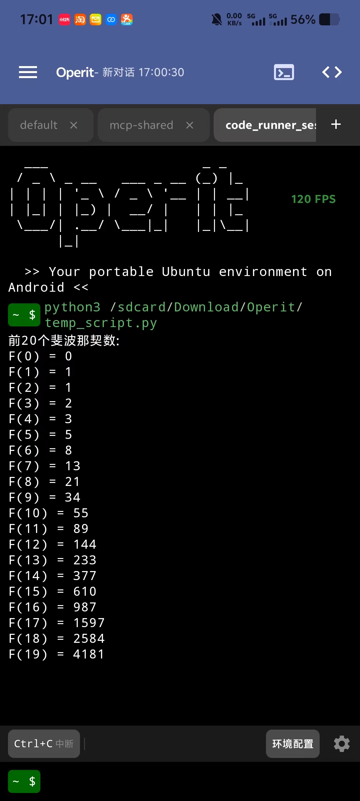

# Operit Terminal

<p align="center">
  
</p>

## 概述

这是一款在 Android 设备上运行的 Ubuntu 24 系统，作为核心组件被集成于 Operit 应用中，为用户提供了一个功能完整、性能强大的移动 Linux 环境。其最大的优势在于与 Operit 的深度集成，提供无缝衔接的开发与操作体验。

## 主要特性

- **完整的 Ubuntu 24 环境**: 在 Android 设备上提供桌面级的 Linux 体验。
- **一键环境配置**: 内置自动化脚本，简化了环境的配置和部署过程。
- **开放的 AIDL 接口**: 通过 AIDL (`Android Interface Definition Language`) 暴露核心功能，允许其他应用安全地进行进程间通信和功能调用，方便开发者进行扩展和集成。

## 技术栈

-   **UI**: 完全使用 [Jetpack Compose](https://developer.android.com/jetpack/compose) 构建，这是 Android 用于构建原生 UI 的现代工具包。
-   **架构**: 遵循响应式架构，使用 [Kotlin Flows](https://developer.android.com/kotlin/flow) 处理核心逻辑与 UI 之间的状态管理和事件传播。
-   **异步编程**: 利用 [Kotlin Coroutines](https://kotlinlang.org/docs/coroutines-overview.html) 管理后台线程和异步操作。
-   **模块化**: 项目分为 `app` 模块（用于 UI）和 `terminal-core` 模块（作为 Git 子模块，用于后端逻辑）。

## 项目结构

本应用采用模块化设计，主要分为以下两个部分：

-   **`app` 模块**: 包含应用的用户界面（UI）和与 Android 系统交互的主要逻辑。
-   **`terminal-core` 模块 (Git Submodule)**: 这是一个独立的模块，包含了终端的核心功能，如会话管理、命令执行和与底层 shell 的交互。它被设计为一个可重用的组件，并通过 AIDL 接口与主 `app` 模块通信。

关于如何克隆和更新包含子模块的仓库，请参考下面的 “获取源码” 部分。

## 架构概述

`Operit Terminal` 构建在一个以 `TerminalManager` 类为中心的模块化架构之上，该类位于 `terminal-core` 模块中。

-   **`TerminalManager` (在 `terminal-core` 中)**: 这个单例类是应用的核心。它管理所有终端会话，处理命令，并持有终端的全部状态（例如，会话、命令历史、当前目录）。它使用 Kotlin Flows 以响应式的方式暴露这些状态。

-   **`MainActivity` (在 `app` 中)**: 应用的主 UI，使用 Jetpack Compose 构建。它直接与 `TerminalManager` 交互以发送命令，并监听其 Kotlin Flows (`collectAsState`)，以便在终端状态发生变化时自动更新 UI。

-   **`TerminalService` 和 AIDL (在 `terminal-core` 中)**: 虽然当前实现中 UI 和核心逻辑运行在同一进程中，但 `terminal-core` 模块也包含一个 `TerminalService`。该服务通过 AIDL 接口暴露 `TerminalManager` 的功能，从而实现了强大的后台执行和进程间通信（IPC）。这种设计使得终端会话可以独立于 UI 生命周期运行。

### AIDL 接口详情

AIDL 接口用于与 `TerminalService` 进行通信。

#### `ITerminalService.aidl`

这是与 `TerminalService` 交互的主要接口。

| 方法名                | 参数                               | 返回值   | 描述                                           |
| --------------------- | ---------------------------------- | -------- | ---------------------------------------------- |
| `createSession`       | -                                  | `String` | 创建一个新的终端会话，并返回其唯一 ID。        |
| `switchToSession`     | `in String sessionId`              | `void`   | 切换到指定 ID 的会话。                         |
| `closeSession`        | `in String sessionId`              | `void`   | 关闭指定 ID 的会话。                           |
| `sendCommand`         | `in String command`                | `void`   | 向当前会话发送一个命令。                       |
| `sendInterruptSignal` | -                                  | `void`   | 向当前会话发送中断信号 (Ctrl+C)。              |
| `registerCallback`    | `in ITerminalCallback callback`    | `void`   | 注册一个回调以接收终端事件更新。               |
| `unregisterCallback`  | `in ITerminalCallback callback`    | `void`   | 取消注册一个回调。                             |
| `requestStateUpdate`  | -                                  | `void`   | 请求立即一次性更新最新的终端状态。 |

#### `ITerminalCallback.aidl`

这是一个单向（`oneway`）接口，用于从服务接收事件更新。客户端需要实现此接口。

| 方法名                        | 参数                                      | 描述                                     |
| ---------------------------- | ----------------------------------------- | ---------------------------------------- |
| `onCommandExecutionUpdate`   | `in CommandExecutionEvent event`         | 当命令执行过程中有输出更新时调用此方法。   |
| `onSessionDirectoryChanged`  | `in SessionDirectoryEvent event`         | 当会话的当前目录更改时调用此方法。     |

### 数据模型

AIDL 接口使用以下事件对象来传输数据：

#### `CommandExecutionEvent`
表示命令执行过程中的事件，包含以下字段：
-   `commandId: String`: 命令的唯一标识符
-   `sessionId: String`: 执行命令的会话ID
-   `outputChunk: String`: 命令执行过程中的输出片段
-   `isCompleted: Boolean`: 命令是否执行完毕

#### `SessionDirectoryEvent`
表示会话目录变化事件，包含以下字段：
-   `sessionId: String`: 会话的唯一标识符
-   `currentDirectory: String`: 会话新的当前工作目录

### UI 和状态处理示例

`MainActivity` 中的 UI 是用 Jetpack Compose 构建的，并通过 Kotlin Flows 订阅来自 `TerminalManager` 的状态变化。这就创建了一个响应式连接，当数据变化时 UI 会自动重组。

以下是一个简化的概念性示例，说明 UI 如何收集状态：

```kotlin
// 在 MainActivity 的 Composable 内容中

// 获取 TerminalManager 实例
val terminalManager = remember { TerminalManager.getInstance(context) }

// 从 Flows 中收集状态
val sessions by terminalManager.sessions.collectAsState(initial = emptyList())
val currentSessionId by terminalManager.currentSessionId.collectAsState(initial = null)
val commandHistory by terminalManager.commandHistory.collectAsState(initial = SnapshotStateList())
val currentDirectory by terminalManager.currentDirectory.collectAsState(initial = "$ ")

// 当任何这些状态持有者发生变化时，UI 将自动更新。
TerminalScreen(
    sessions = sessions,
    currentSessionId = currentSessionId,
    commandHistory = commandHistory,
    currentDirectory = currentDirectory,
    // ... 其他参数和事件处理程序
)
```

这种响应式方法简化了 UI 逻辑，因为它不需要手动请求更新，只需观察 `TerminalManager` 提供的状态即可。

## 构建配置

### 密钥配置

为了构建发布版本，需要配置签名密钥。请按照以下步骤操作：

1. 在项目根目录创建 `keystore.properties` 文件
2. 添加以下配置项（请替换为你的实际值）：

```properties
RELEASE_KEY_ALIAS=你的密钥别名
RELEASE_KEY_PASSWORD=你的密钥密码
RELEASE_STORE_FILE=你的密钥库文件路径
RELEASE_STORE_PASSWORD=你的密钥库密码
```

**注意：**
- `keystore.properties` 文件包含敏感信息，不应提交到版本控制系统
- 该文件已被添加到 `.gitignore` 中，确保不会意外提交
- 如果没有配置密钥，debug版本仍可正常构建和运行

### Android SDK配置

项目使用 `local.properties` 文件配置Android SDK路径：
- 该文件由Android Studio自动生成
- 包含本地SDK路径配置
- 不应提交到版本控制系统

## 许可证

遵循 GPLv3 协议。

## 获取源码

由于本项目使用了 Git Submodule 来管理核心依赖 (`terminal-core`)，请使用以下命令来克隆仓库以确保所有模块都被正确下载：

```bash
git clone --recurse-submodules https://github.com/your-username/your-repository.git
```

如果你已经克隆了仓库但没有初始化子模块，可以运行以下命令：

```bash
git submodule update --init --recursive
```
